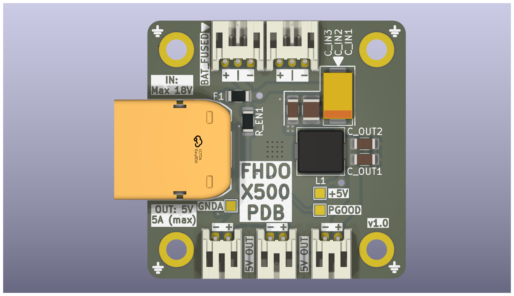

# LM21305-Based Power Distribution Board

## Overview

This project describes a compact power distribution board (PDB) for multicopter applications. The design is based on the LM21305 synchronous buck regulator and provides regulated 5 V outputs alongside direct battery connections.

The board follows a 30 × 30 mm mounting pattern, compatible with standard flight controller stacks.

## Features

- LM21305-based DC-DC regulation
- 30 × 30 mm mounting pattern
- Maximum output current: 5 A
- 3 × regulated 5 V outputs (JST-PH 2.0)
- 2 × battery outputs (JST-PH 2.0)

## Specifications

| Parameter         | Value                  |
|------------------|------------------------|
| Input Voltage     | 3 V – 18 V             |
| Regulated Output  | 5 V                    |
| Maximum Current   | 5 A (total)            |
| Mounting Pattern  | 30 × 30 mm             |
| Connectors        | JST-PH 2.0             |

## LM21305 Regulator Summary

The LM21305 is a synchronous step-down (buck) DC-DC converter with integrated power MOSFETs and peak current-mode control. :contentReference[oaicite:0]{index=0}  

Key characteristics:

- Input voltage range: 3 V to 18 V 
- Output current capability: up to 5 A 
- Adjustable switching frequency: 300 kHz to 1.5 MHz
- Integrated high-side and low-side MOSFETs 

Functional features:

- Peak current-mode control for fast transient response 
- Internal soft-start and enable control
- Cycle-by-cycle overcurrent protection and thermal shutdown
- Overvoltage and undervoltage protection

These characteristics enable high efficiency and compact external component selection.

## Electrical Interfaces

### 5 V Outputs (3×)
- 5 V
- Ground

### Battery Outputs (2×)
- VBAT
- Ground

## Mechanical Details

- Mounting hole spacing:  30 mm × 30 mm (M3 compatible)

## Contributions

Contributions and issue reports are welcome.
